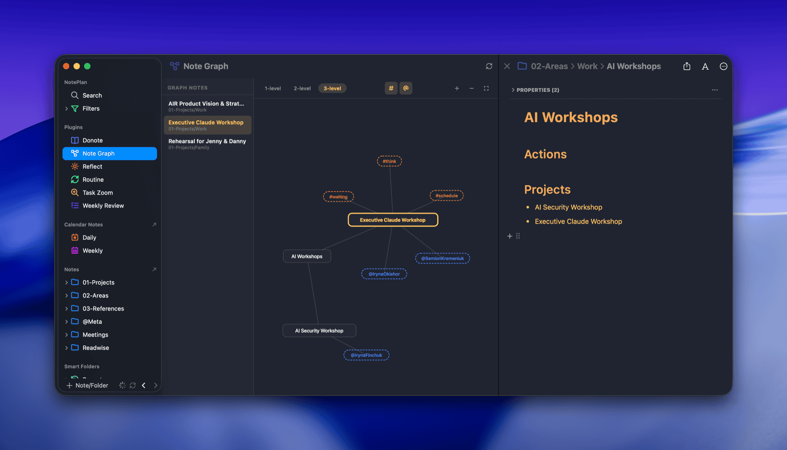

# Note Graph for NotePlan

An interactive force-directed graph visualization of note connections for [NotePlan](https://noteplan.co). See how your notes link to each other through wiki links and backlinks, with optional hashtag and mention overlays.



## Features

- **Force-directed graph** — nodes repel each other, connected nodes attract, layout settles naturally
- **Draggable nodes** — grab and reposition any node, the graph rebalances around it
- **Depth levels** — toggle between 1-level, 2-level, and 3-level link depth
- **Hashtag overlay** — toggle to see `#tags` as orange dashed nodes connected to their notes
- **Mention overlay** — toggle to see `@mentions` as blue dashed nodes connected to their notes
- **Link discovery** — uses NotePlan's native `note.linkedNoteTitles` and `note.backlinks` API (with regex fallback)
- **Left sidebar** — list of notes added to the graph, click to re-center
- **Click to open** — click any node to open the note in split view
- **Zoom** — scroll wheel, +/- buttons, or fit-to-view
- **Light/dark theme** — adapts to NotePlan's current theme

## Visual Design

- **Selected note**: accent-colored border, bold text
- **Graph notes** (added via command): accent border
- **Discovered notes** (found via links): subtle border
- **Tags**: orange dashed pill, smaller text
- **Mentions**: blue dashed pill, smaller text
- **Edges**: subtle lines connecting related nodes

## Adding Notes to the Graph

Add `graph: true` to a note's YAML frontmatter, or use the slash command:

```
/Add or remove note from graph
```

This toggles `graph: true` in the current note's frontmatter. Notes with this property appear in the left sidebar and serve as entry points for the graph.

## How It Works

1. On load, scans all notes with `graph: true` frontmatter
2. For the selected note, discovers outgoing wiki links (`[[Note Name]]`) and backlinks
3. At depth 2+, also discovers links of linked notes (BFS traversal)
4. Optionally includes hashtags and mentions from each note as additional nodes
5. All graph data is pre-built for every depth × toggle combination (instant switching)
6. Force simulation runs client-side in the WebView using SVG + requestAnimationFrame

## Installation

1. Copy the `asktru.NoteGraph` folder into your NotePlan plugins directory:
   ```
   ~/Library/Containers/co.noteplan.NotePlan*/Data/Library/Application Support/co.noteplan.NotePlan*/Plugins/
   ```
2. Restart NotePlan
3. Note Graph appears in the sidebar under Plugins

## Settings

- **Folders to Exclude** — comma-separated folder names to skip when scanning (default: `@Archive, @Trash, @Templates`)

## License

MIT
